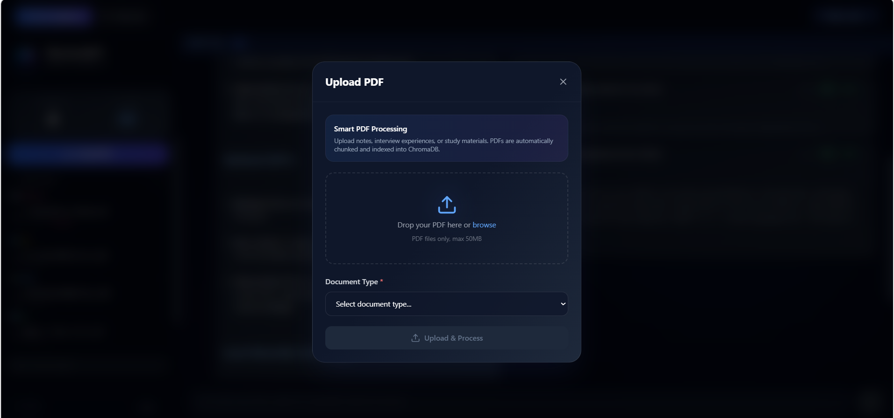
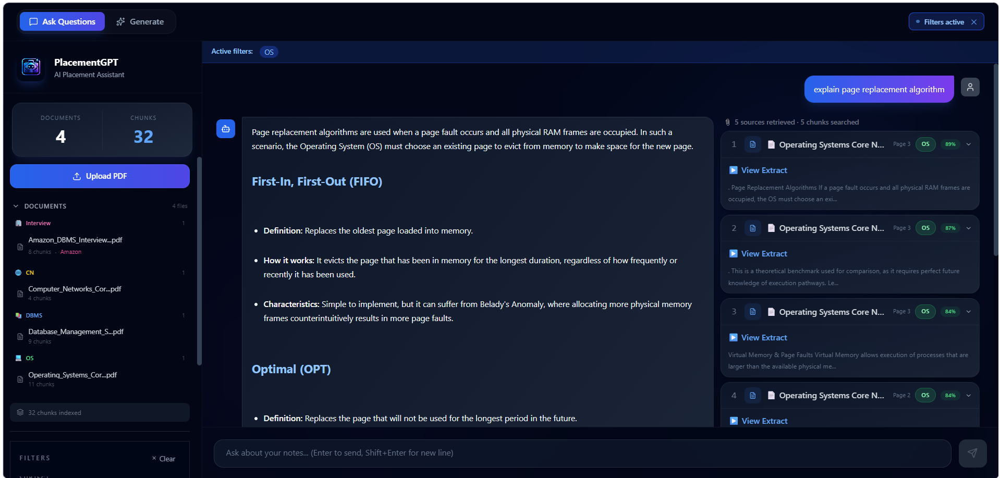
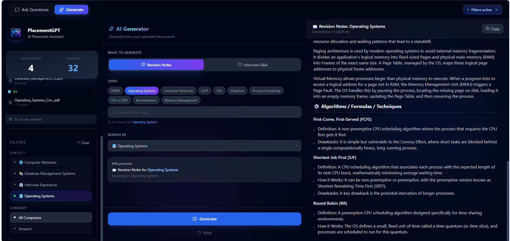
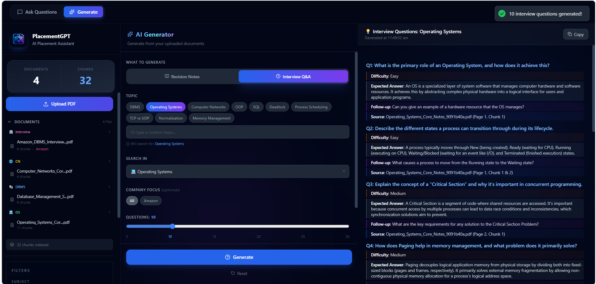

# PlacementGPT 🎓

**AI-Powered Placement Preparation Assistant** built using **Retrieval-Augmented Generation (RAG)**, **Gemini 2.5 Flash**, **Gemini Embeddings**, **ChromaDB**, **FastAPI**, and **React**.

---

## Overview

PlacementGPT is a full-stack AI application that helps students prepare for placements using their own study materials and interview experiences.

Instead of relying on generic internet knowledge, the system retrieves relevant content from uploaded PDFs using semantic search and generates grounded responses with source citations.

### Key Features

*
*  PDF Upload & Automatic Indexing
*  RAG-based Question Answering
*  Semantic Search using Vector Embeddings
*  AI-Powered Revision Notes Generation
*  Interview Question Generation
*  Company-wise Interview Experience Filtering
*  Subject-wise Document Filtering
*  Source Citations & Retrieved Chunks
*  Similarity Score Display
*  Multi-Document Retrieval

---

## Live Demo Screenshots

### PDF Upload & Processing



Upload study notes and interview experiences. Documents are automatically processed, chunked, embedded, and indexed into ChromaDB.

---

### RAG Question Answering



Ask questions from uploaded notes and receive context-aware answers generated using Retrieval-Augmented Generation.

---

### Revision Notes Generator



Generate concise and structured revision notes directly from uploaded study material.

---

### Interview Question Generator



Generate topic-specific interview questions with expected answers and follow-up questions.

---

## Tech Stack

### Frontend

* React 18
* Vite
* Tailwind CSS
* Axios

### Backend

* FastAPI
* Python 3.11
* Pydantic
* Uvicorn

### AI / RAG Pipeline

* Gemini 2.5 Flash (LLM)
* Gemini Embedding 001
* ChromaDB (Vector Database)
* Semantic Similarity Search
* Retrieval-Augmented Generation (RAG)

### PDF Processing

* PyPDF

---

## RAG Architecture

```text
PDF Upload
    ↓
Text Extraction
    ↓
Chunking
    ↓
Gemini Embedding 001
    ↓
ChromaDB Storage

────────────────────────────

User Query
    ↓
Query Embedding
    ↓
Semantic Similarity Search
    ↓
Top-K Relevant Chunks
    ↓
Context Assembly
    ↓
Gemini 2.5 Flash
    ↓
Grounded Answer + Citations
```

---

## Project Structure

```text
PlacementGPT/
│
├── backend/
│   ├── database/
│   ├── models/
│   ├── routers/
│   ├── services/
│   ├── utils/
│   ├── requirements.txt
│   └── main.py
│
├── frontend/
│   ├── src/
│   │   ├── api/
│   │   ├── components/
│   │   ├── hooks/
│   │   ├── pages/
│   │   └── utils/
│   └── package.json
│
└── README.md
```

---

## API Endpoints

| Method | Endpoint                       |
| ------ | ------------------------------ |
| POST   | `/api/v1/upload`               |
| GET    | `/api/v1/documents`            |
| DELETE | `/api/v1/documents/{filename}` |
| POST   | `/api/v1/query`                |
| GET    | `/api/v1/filters`              |
| POST   | `/api/v1/generate`             |

---

## Installation

### Backend

```bash
cd backend

python -m venv venv
venv\Scripts\activate

pip install -r requirements.txt
```

Create a `.env` file:

```env
GOOGLE_API_KEY=your_api_key_here
```

Run:

```bash
uvicorn main:app --reload
```

Swagger Docs:

```text
http://localhost:8000/docs
```

---

### Frontend

```bash
cd frontend

npm install
npm run dev
```

Frontend:

```text
http://localhost:5173
```

---

## Resume Highlights

* Built an end-to-end Retrieval-Augmented Generation (RAG) system using Gemini and ChromaDB
* Implemented semantic document retrieval using vector embeddings and similarity search
* Developed a full-stack AI application using React and FastAPI
* Built citation-based question answering grounded in uploaded PDFs
* Added AI-powered revision note and interview question generation features
* Designed metadata filtering for subjects and companies

---

## Author

**Ritisha Sidana**

B.Tech Computer Engineering
Thapar Institute of Engineering & Technology

GitHub: https://github.com/ritishasidana

LinkedIn: https://www.linkedin.com/in/ritisha-sidana-8bb561318
